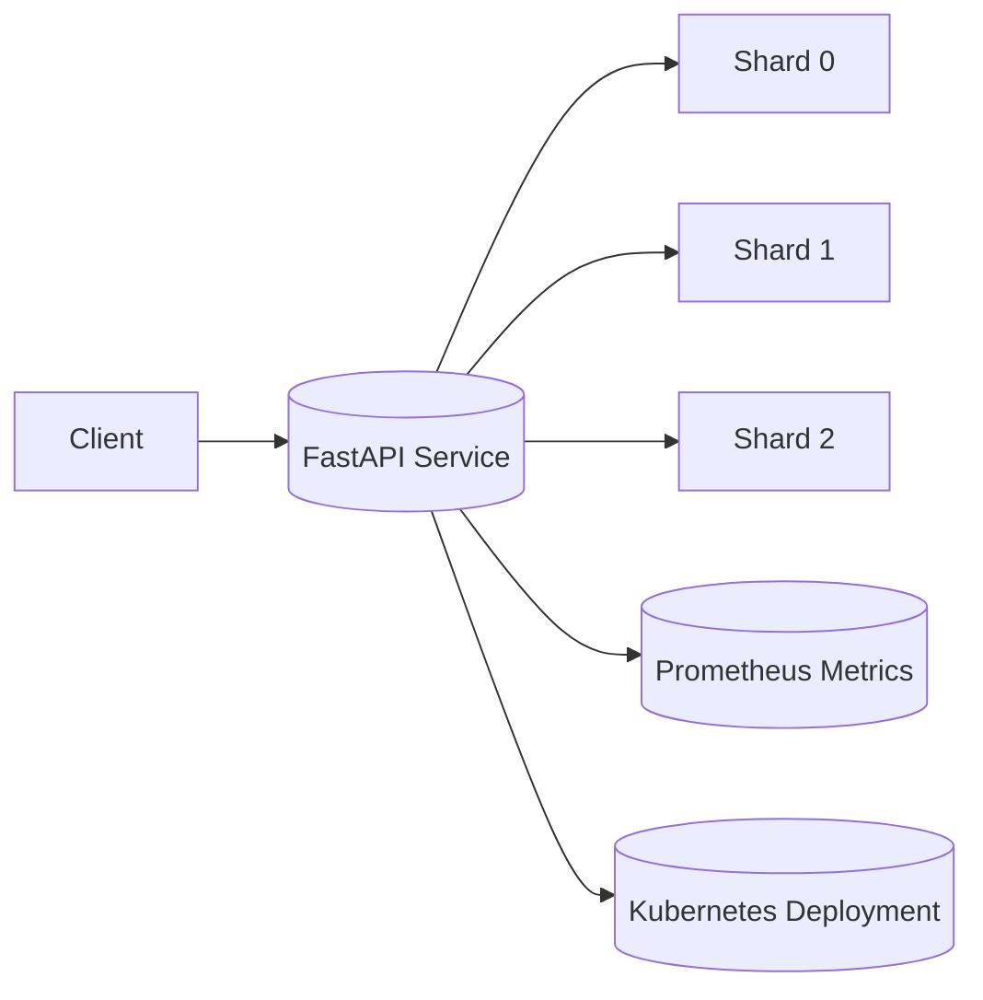

# Sharded Data Service

## Overview
The **Sharded Data Service** is a simple microservice built with **FastAPI** that distributes user data across multiple in-memory shards.
The goal of this project is to build a service with a single endpoint, **POST /store**, where each request contains a userId and some associated data. I use a simple in-memory sharding mechanism — distributing data across N shards using `userId % N`. The project also exposes Prometheus metrics for observability and includes a demo script plus Kubernetes deployment files.
Each of incoming request is routed to a shard based on `userId % N`.  

The service:
- Exposes **Prometheus metrics** (`/metrics`)  
- Is **containerized using Docker**  
- Can be **deployed to Kubernetes**  
- Includes a **demo script** for local or cluster testing  

---

## Features Includes:
- Single core API endpoint: `POST /store`
- Single API endpoint: `POST /store`
- In-memory sharding (`userId % N`)
- Prometheus metrics for observability
- Dockerfile for containerization
- Kubernetes manifests for deployment
- Demo script for automated testing

---

## API Endpoints

### **POST /store**
Stores user data into the corresponding shard.

**Request Body:**
```json
{
  "userId": 15,
  "data": "User data example"
}
```

**Response:**
```json
{
  "message": "Data stored in shard 0"
}
```

### **GET /shards**
Returns the current in-memory shard distribution. Useful for debugging/demo.

### **GET /health**
Simple health endpoint returning `{ "status": "ok" }`.

---


## Prometheus Metrics
Prometheus metrics are served by the application on a separate HTTP server started by the app (default port **8001**). The FastAPI API typically runs on port **8000** when using uvicorn. Metrics include:
- `requests_total{shard="<index>"}` – Total requests per shard  
- `shard_size{shard="<index>"}` – Number of items currently stored in each shard  

Access metrics at: **http://localhost:8001/metrics** (when running locally or port-forwarding appropriately in Kubernetes).

---

## Local Setup (Python + Uvicorn)

### 1️ Clone the Repository
```bash
git clone https://github.com/Caryourdaysbm/sharded-data-service.git
cd sharded-data-service
```

### 2 Create virtual environment (recommended)
```bash
python -m venv .venv
source .venv/bin/activate   # Linux / macOS
.venv\Scripts\activate    # Windows PowerShell
```

### 3 Install dependencies
```bash
pip install -r requirements.txt 
```
or 

```bash
py -m pip install -r requirements.txt   
```

### 4 Start the service with Uvicorn
Start the application (FastAPI) with uvicorn on port 8000 and the Prometheus metrics server will start on port 8001 automatically (this is handled by the app startup code):

```bash
python -m uvicorn app:app --host 0.0.0.0 --port 8000
```
 # to run the demo, In a new PowerShell window:
  ```bash
  python .\demo.py
  ```
- API base: `http://localhost:8000`  
- Store endpoint: `http://localhost:8000/store`  
- Shard debug: `http://localhost:8000/shards`  
- View Health: `http://localhost:8000/health`  
- View Metrics: `http://localhost:8001/metrics`

**Note:** Keep the terminal running for the server. Open a new terminal to run the demo script or curl requests.

---


## Docker Setup

### Build the Docker image
```bash
docker build -t <yourown-dockerhub-username>/sharded-service:latest .
```

### Run the container locally (optional)
The container runs both the FastAPI app and the Prometheus metrics server (metrics port 8001 is exposed in the Dockerfile):

```bash
docker run -d -p 8000:8000 -p 8001:8001 --name sharded-service <your-owndockerhub-username>/sharded-service:latest
```

Visit the same endpoints as above (`/store`, `/shards`, `/metrics`).

---

## Kubernetes Deployment

### 1️⃣ Push Docker Image
```bash
docker login
docker push <your-owndockerhub-username>/sharded-service:latest
```

### 2️⃣ Update `deployment.yaml`
Set the image to your pushed image:
```yaml
image: <yourown-dockerhub-username>/sharded-service:latest
```

### 3️⃣ Apply deployment and service
```bash
kubectl apply -f deployment.yaml
kubectl get pods --watch
```

### 4️⃣ If pod is in ImagePullBackOff or Pending
- Ensure the image exists and is public on Docker Hub.
- If private, create a Kubernetes imagePullSecret and reference it in the deployment.
- Increase Docker Desktop resources if you see `Insufficient cpu/memory`.

### 5️⃣ Port-forward for local access (after pod is Running)
```bash
kubectl port-forward svc/sharded-service 8000:80
```

- API: `http://localhost:8000`  
- Metrics: `http://localhost:8001/metrics` (metrics port is on the pod; port-forward maps API port — to access metrics locally you may need to port-forward the pod port 8001 as well, e.g.: `kubectl port-forward <pod-name> 8001:8001`)

---

## Demo Instructions

### Run demo against local Uvicorn server
1. Start the server (see Local Setup) in one terminal.  
2. In a separate terminal run:
```bash
python demo.py
```
The demo sends sample POST requests to `/store` and prints the shard distribution.

### Run demo against Kubernetes deployment
1. Ensure pod is `Running` (use `kubectl get pods`).  
2. Port-forward API and metrics (if needed):
```bash
kubectl port-forward svc/sharded-service 8000:80
kubectl port-forward pod/<pod-name> 8001:8001  # to access metrics directly
```
3. Run the demo:
```bash
python demo_k8s.py
```

---

## Example Output (demo)
```
{'message': 'Stored in shard 1'}
{'message': 'Stored in shard 2'}
{'message': 'Stored in shard 0'}
{'message': 'Stored in shard 1'}
Shard distribution: {'shard_0': {3: 'Charlie'}, 'shard_1': {1: 'Alice', 4: 'Diana'}, 'shard_2': {2: 'Bob'}}
```

---

## Troubleshooting Tips

- **Uvicorn not starting**: Ensure dependencies installed and `app.py` present.  
- **ImagePullBackOff**: Confirm image tag and repository name; push image to Docker Hub; check `kubectl describe pod <pod>` for events.  
- **Metrics not visible**: Ensure metrics server port 8001 is reachable; if using Kubernetes, port-forward the pod's metrics port.  
- **Pod pending due to resources**: Increase Docker Desktop resources or reduce pod resource requests.

---

## Future Improvements
- Add persistent storage for shards (Redis/Postgres).  
- Add Grafana dashboards for visualization.  
- Implement shard rebalancing and persistence.  

---

## Architecture Design

### Components:
- **Client:** Sends POST requests  
- **FastAPI Service:** Receives data, applies `userId % N` logic  
- **Shards:** Hold in-memory user data  
- **Prometheus:** Collects metrics  
- **Kubernetes:** Orchestrates service deployment and scaling  

### Diagram (simplified)


---

## Metrics Visualization (Optional)
You can deploy **Prometheus** in your cluster to scrape metrics from the `/metrics` endpoint:

```bash
kubectl apply -f prometheus.yaml
```

View metrics at **Prometheus dashboard** or export to **Grafana**.

---

## Future Improvements
- Add persistent storage for shards  
- Enable auto-scaling with Kubernetes HPA  
- Add a frontend dashboard for shard visualization  
- Integrate Grafana dashboards for richer analytics  

---

## Author
**Oluwakayode Samuel Adeyemi**  
Built with FastAPI, Docker, Prometheus & Kubernetes  
adeyemioluwakayode73@gmail.com