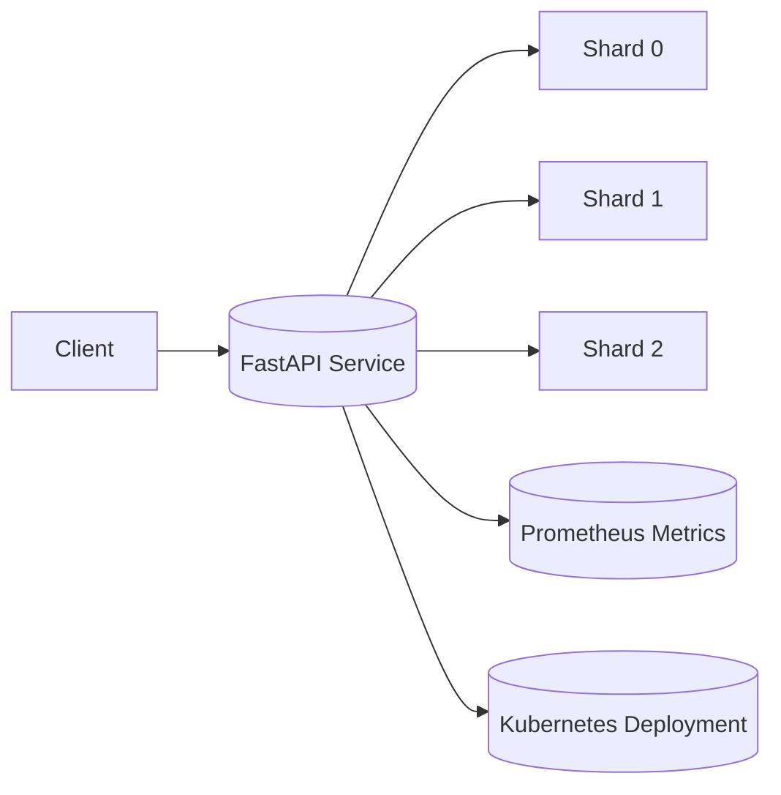

# Sharded Data Service

## Overview
The **Sharded Data Service** is a simple microservice built with **FastAPI** that distributes user data across multiple in-memory shards.  
Each of incoming request is routed to a shard based on `userId % N`.  

The service:
- Exposes **Prometheus metrics** (`/metrics`)  
- Is **containerized using Docker**  
- Can be **deployed to Kubernetes**  
- Includes a **demo script** for local or cluster testing  

---

## Features Includes:
- Single API endpoint: `POST /store`
- In-memory sharding (`userId % N`)
- Prometheus metrics for observability
- Dockerfile for containerization
- Kubernetes manifests for deployment
- Demo script for automated testing

---

## API Endpoints

### **POST /store**
Stores user data into the corresponding shard.

**Request Body:**
```json
{
  "userId": 15,
  "data": "User data example"
}
```

**Response:**
```json
{
  "message": "Data stored in shard 0"
}
```

---

## Prometheus Metrics
Exposed at: **`/metrics`**

Metrics include:
- `request_count_total` – Total number of requests received  
- `shard_request_count` – Number of requests per shard  
- `shard_distribution` – Distribution of stored records across shards  

---

## Local Setup

### 1️⃣ Clone the Repository
```bash
git clone https://github.com/Caryourdaysbm/sharded-data-service.git
cd sharded-data-service
```

### 2️⃣ Build and Run with Docker
```bash
docker build -t <your-own-dockerhub-username>/sharded-service:latest .
docker run -p 8000:8000 <your-owndockerhub-username>/sharded-service:latest
```

Access the service at **http://localhost:8000**

---

## Kubernetes Deployment

### 1️⃣ Push Docker Image
```bash
docker login
docker push <yourown-dockerhub-username>/sharded-service:latest
```

### 2️⃣ Apply Kubernetes Configs
```bash
kubectl apply -f deployment.yaml
kubectl apply -f service.yaml
```

### 3️⃣ Verify Deployment
```bash
kubectl get pods
kubectl get svc
```

### 4️⃣ Port Forward for Local Access
```bash
kubectl port-forward svc/sharded-service 8000:80
```

Service will be available at **http://localhost:8000**

---

## Demo Instructions

### Run Automated Demo
```bash
python demo.py
```

This sends multiple POST requests to `/store` and displays:
- Shard assignments  
- Metrics summary  

Example output:
```
Storing data for user 10 → Shard 1
Storing data for user 11 → Shard 2
Storing data for user 12 → Shard 0
...
✅ Demo completed successfully
```

---

## Architecture Design

### Components:
- **Client:** Sends POST requests  
- **FastAPI Service:** Receives data, applies `userId % N` logic  
- **Shards:** Hold in-memory user data  
- **Prometheus:** Collects metrics  
- **Kubernetes:** Orchestrates service deployment and scaling  

### Diagram (simplified)


---

## Metrics Visualization (Optional)
You can deploy **Prometheus** in your cluster to scrape metrics from the `/metrics` endpoint:

```bash
kubectl apply -f prometheus.yaml
```

View metrics at **Prometheus dashboard** or export to **Grafana**.

---

## Future Improvements
- Add persistent storage for shards  
- Enable auto-scaling with Kubernetes HPA  
- Add a frontend dashboard for shard visualization  
- Integrate Grafana dashboards for richer analytics  

---

## Author
**Oluwakayode Samuel Adeyemi**  
Built with FastAPI, Docker, Prometheus & Kubernetes  
adeyemioluwakayode73@gmail.com